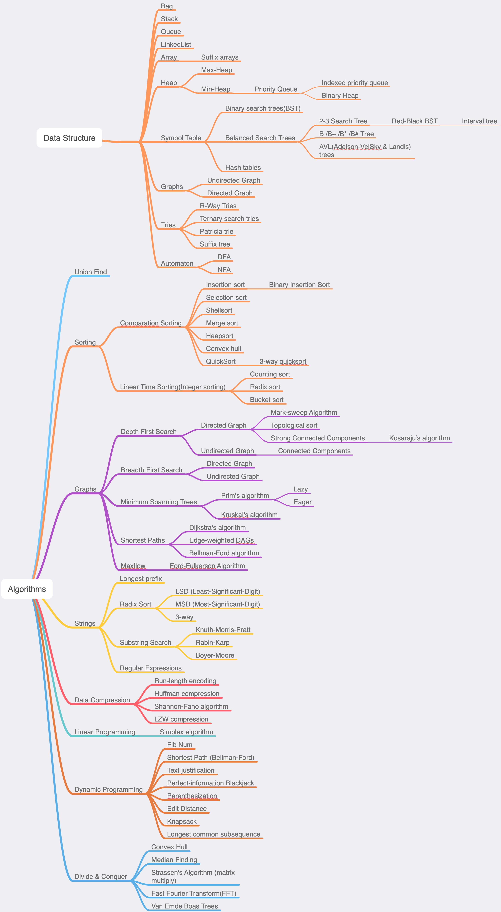

## Note
Please feel free to send **Pull Request**, **Issue** or give this repo a big **Star**, thank you!

## My Leetcode Solutions
**bold** num means I DO NOT come up a solution by myself...

| # | Title | Solution | Difficulty |
|---| ----- | -------- | ---------- |
|1|[Two Sum](https://leetcode.com/problems/two-sum/) | [Swift](./algorithms/swift/2Sum/2Sum.swift)|Easy|
|2|[Add Two Numbers](https://leetcode.com/problems/add-two-numbers/) | [Swift](./algorithms/swift/addTwoNumbers/addTwoNumbers.swift)|Medium|
|11|[Container With Most Water](https://leetcode.com/problems/container-with-most-water/) | [Swift](./algorithms/swift/addTwoNumbers/addTwoNumbers.swift)|Medium|
|14|[Longest Common Prefix](https://leetcode.com/problems/longest-common-prefix/) | [Java](./algorithms/java/longestCommonPrefix/longestCommonPrefix.swift)|Easy|
|15|[3Sum](https://leetcode.com/problems/3sum/) | [Swift](./algorithms/swift/3Sum/3Sum.swift), [Python](./algorithms/python/3Sum/3Sum.py), [Python](./algorithms/python/3Sum/3SumII.py)|Medium|
|16|[3Sum Closest](https://leetcode.com/problems/3sum-closest/) | [Swift](./algorithms/swift/3sumClosest/3sumClosest.swift)|Medium|
|18|[4Sum](https://leetcode.com/problems/4sum/) | [Swift](./algorithms/swift/4sum/4sum.swift)|Medium|
|19|[Remove Nth Node From End of List](https://leetcode.com/problems/remove-nth-node-from-end-of-list/) | [Java](./algorithms/java/removeNthNodeFromEndOfList/removeNthNodeFromEndOfList.java), [Swift](./algorithms/swift/removeNthNodeFromEndOfList/removeNthNodeFromEndOfList.swift)|Medium|
|20|[Valid Parentheses](https://leetcode.com/problems/valid-parentheses) | [Swift](./algorithms/swift/validParentheses/validParentheses.swift)|Easy|
|21|[Merge Two Sorted Lists](https://leetcode.com/problems/merge-two-sorted-lists/) | [Swift](./algorithms/java/mergeTwoSortedList/mergeTwoSortedList.java)|Easy|
|22|[Generate Parentheses](https://leetcode.com/problems/generate-parentheses/) | [Swift](./algorithms/swift/generateParentheses/generateParentheses.swift), [Python](./algorithms/python/generateParentheses/generateParentheses.py)|Medium|
|**23**|[Merge k Sorted Lists](https://leetcode.com/problems/merge-k-sorted-lists/) | [Python2](./algorithms/python/mergeKSortedLists/mergeKSortedLists.py)|Hard|
|24|[Swap Nodes in Pairs](https://leetcode.com/problems/swap-nodes-in-pairs/) | [Swift](./algorithms/swift/swapNodesInPairs/swapNodesInPairs.swift)|Medium|
|25|[Reverse Nodes in k-Group](https://leetcode.com/problems/reverse-nodes-in-k-group/) | [Swift](./algorithms/swift/reverseNodesInKGroup/reverseNodesInKGroup.swift)|Hard|
|26|[Remove Duplicates from Sorted Array](https://leetcode.com/problems/remove-duplicates-from-sorted-array/) | [Swift](./algorithms/swift/removeDuplicatesFromSortedArray/removeDuplicatesFromSortedArray.swift)|Easy|
|27|[Remove Element](https://leetcode.com/problems/remove-element/) | [Swift](./algorithms/swift/removeElement/removeElement.swift)|Easy|
|28|[Implement strStr()](https://leetcode.com/problems/implement-strstr/) | [Swift](./algorithms/swift/implementStrStr/implementStrStr().swift)|Easy|
|31|[Next Permutation](https://leetcode.com/problems/next-permutation/) | [Swift](./algorithms/swift/nextPermutation/nextPermutation.swift)| Medium |
|32|[Longest Valid Parentheses](https://leetcode.com/problems/longest-valid-parentheses/) | [Swift](./algorithms/swift/longestValidParentheses/longestValidParentheses.swift)|Hard|
|33|[Search in Rotated Sorted Array](https://leetcode.com/problems/search-in-rotated-sorted-array/) | [Swift](./algorithms/swift/searchInRotatedSortedArray/searchInRotatedSortedArray.swift)|Medium|
|34|[Find First and Last Position of Element in Sorted Array](https://leetcode.com/problems/find-first-and-last-position-of-element-in-sorted-array/) | [Swift](./algorithms/swift/findFirstAndLastPositionOfElementInSortedArray/findFirstAndLastPositionOfElementInSortedArray.swift)|Medium|
|35|[Search Insert Position](https://leetcode.com/problems/search-insert-position/) | [Swift](./algorithms/swift/searchInsertPosition/searchInsertPosition.swift)|Easy|
|36|[Valid Sudoku](https://leetcode.com/problems/valid-sudoku/) | [Swift](./algorithms/swift/validSudoku/validSudoku.swift)|Medium|
|37|[Sudoku Solver](https://leetcode.com/problems/sudoku-solver/) | [Swift](./algorithms/swift/sudokuSolver/sudokuSolver.swift)|Hard|
|39|[Combination Sum](https://leetcode.com/problems/combination-sum/) | [Swift](./algorithms/swift/combinationSum/combinationSum.swift)| Medium |
|**42**|[Trapping Rain Water](https://leetcode.com/problems/trapping-rain-water/) | [Swift](./algorithms/swift/trappingRainWater/trappingRainWater.swift)|Hard|
|48|[Rotate Image](https://leetcode.com/problems/rotate-image/) | [Swift](./algorithms/swift/rotateImage/rotateImage.swift)|Medium|
|50|[Pow(x,n)](https://leetcode.com/problems/powx-n/) | [Swift](./algorithms/swift/pow/pow.swift), [Python](./algorithms/python/pow/pow.py)|Medium|
|51|[N-Queens](https://leetcode.com/problems/n-queens/) | [Swift](./algorithms/swift/nQueens/nQueens.swift),[Swift](./algorithms/swift/nQueens/nQueensII.swift), [Python](./algorithms/python/nQueens/nQueens.py) |Hard|
|52|[N-Queens II](https://leetcode.com/problems/n-queens/) | [Swift](./algorithms/swift/nQueensII/nQueensII.swift)|Hard|
|53|[Maximum SubArray](https://leetcode.com/problems/maximum-subarray/) | [Swift](./algorithms/swift/maximumSubarray/maximumSubarray.swift)|Easy|
|54|[Spiral Matrix](https://leetcode.com/problems/spiral-matrix/) | [Swift](./algorithms/swift/spiralMatrix/spiralMatrix.swift)|Medium|
|55|[Jump Game](https://leetcode.com/problems/jump-game/) | [Swift](./algorithms/swift/jumpGame/jumpGame.swift)|Medium|
|56|[Spiral Matrix](https://leetcode.com/problems/merge-intervals/) | [Swift](./algorithms/swift/mergeIntervals/mergeIntervals.swift)|Medium|
|59|[Spiral Matrix II](https://leetcode.com/problems/spiral-matrix-ii/) | [Swift](./algorithms/swift/spiralMatrixII/spiralMatrixII.swift)|Medium|
|61|[Rotate List](https://leetcode.com/problems/rotate-list/) | [Java](./algorithms/java/rotateList/rotateList.java)|Medium|
|62|[Unique Paths](https://leetcode.com/problems/unique-paths/) | [Swift](./algorithms/swift/uniquePaths/uniquePaths.swift)|Medium|
|63|[Unique Paths II](https://leetcode.com/problems/unique-paths-ii/) | [Swift](./algorithms/swift/uniquePaths-II/uniquePaths-II.swift)|Medium|
|64|[Minimum Path Sum](https://leetcode.com/problems/minimum-path-sum/) | [Swift](./algorithms/swift/minimumPathSum/minimumPathSum.swift)|Medium|
|66|[Plus One](https://leetcode.com/problems/plus-one) | [Swift](./algorithms/swift/plusOne/plusOne.swift)|Easy|
|67|[Add Binary](https://leetcode.com/problems/add-binary/) | [Swift](./algorithms/swift/addBinary/addBinary.swift)|Easy|
|69|[Sqrt(x)](https://leetcode.com/problems/sqrtx/) | [Swift](./algorithms/swift/sqrtx/sqrtx.swift), [Swift](./algorithms/swift/sqrtx/sqrtxII.swift)|Easy|
|70|[Climbing Stairs](https://leetcode.com/problems/climbing-stairs/) | [Swift](./algorithms/swift/climbingStairs/climbingStairs.swift), [Swift](./algorithms/swift/climbingStairs/climbingStairs-II.swift)|Easy|
|72|[Edit Distance](https://leetcode.com/problems/edit-distance/) | [Swift](./algorithms/swift/editDistance/editDistance.swift)|Hard|
|73|[Set Matrix Zeroes](https://leetcode.com/problems/set-matrix-zeroes/) | [Swift](./algorithms/swift/setMatrixZeroes/setMatrixZeroes.swift)|Medium|
|74|[Search a 2D Matrix](https://leetcode.com/problems/search-a-2d-matrix/) | [Swift](./algorithms/swift/searchA2DMatrix/searchA2DMatrix.swift)|Medium|
|75|[Sort Colors](https://leetcode.com/problems/sort-colors/) | [Swift](./algorithms/swift/sortColors/sortColors.swift)|Medium|
|78|[Subsets](https://leetcode.com/problems/subsets/) | [Swift](./algorithms/swift/subsets/subsets.swift)|Medium|
|79|[Word Search](https://leetcode.com/problems/word-search/) | [Swift](./algorithms/swift/wordSearch/wordSearch.swift)|Medium|
|80|[Remove Duplicates from Sorted Array II](https://leetcode.com/problems/remove-duplicates-from-sorted-array-ii/) | [Swift](./algorithms/swift/removeDuplicatesFromSortedArray-II/removeDuplicatesFromSortedArray-II.swift)|Medium|
|**81**|[Search in Rotated Sorted Array II](https://leetcode.com/problems/search-in-rotated-sorted-array-ii/) | [Swift](./algorithms/swift/searchInRotatedSortedArrayII/searchInRotatedSortedArrayII.swift)|Medium|
|82|[Remove Duplicates from Sorted List II](https://leetcode.com/problems/remove-duplicates-from-sorted-list-ii/) | [Swift](./algorithms/swift/removeNthNodeFromEndOfList/removeNthNodeFromEndOfList.swift)|Medium|
|83|[Remove Duplicates from Sorted List](https://leetcode.com/problems/remove-duplicates-from-sorted-list/) | [Swift](./algorithms/swift/removeDuplicatesFromSortedList/removeDuplicatesFromSortedList.swift)| Easy |
|88|[Merge Sorted Array](https://leetcode.com/problems/merge-sorted-array/) | [Swift](./algorithms/swift/mergeSortedArray/mergeSortedArray.swift)| Easy |
|90|[Subsets II](https://leetcode.com/problems/subsets-ii/) | [Swift](./algorithms/swift/subsets-II/subsets-II.swift)| Medium |
|98|[Validate Binary Search Tree](https://leetcode.com/problems/validate-binary-search-tree/) | [Swift](./algorithms/swift/validateBinarySearchTree/validateBinarySearchTree.swift), [Python](./algorithms/python/validateBinarySearchTree/validateBinarySearchTree.py) |Medium|
|100|[Same Tree](https://leetcode.com/problems/same-tree/) | [Swift](./algorithms/swift/sameTree/sameTree.swift) |Easy|
|102|[Binary Tree Level Order Traversal](https://leetcode.com/problems/binary-tree-level-order-traversal/) | [Swift](./algorithms/swift/binaryTreeLevelOrderTraversal/binaryTreeLevelOrderTraversal.swift), [Python](./algorithms/python/binaryTreeLevelOrderTraversal/binaryTreeLevelOrderTraversal.py), [Python](./algorithms/python/binaryTreeLevelOrderTraversal/binaryTreeLevelOrderTraversalII.py)|Medium|
|104|[Maximum Depth of Binary Tree](https://leetcode.com/problems/maximum-depth-of-binary-tree/) | [Swift](./algorithms/swift/maximumDepthOfBinaryTree/maximumDepthOfBinaryTree.swift)|Easy|
|105|[Construct Binary Tree from Preorder and Inorder Traversal](https://leetcode.com/problems/construct-binary-tree-from-preorder-and-inorder-traversal/) | [Swift](./algorithms/swift/constructBinaryTreeFromPreorderAndInorderTraversal/constructBinaryTreeFromPreorderAndInorderTraversal.swift)|Medium|
|106|[Construct Binary Tree from Inorder and Postorder Traversal](https://leetcode.com/problems/construct-binary-tree-from-preorder-and-inorder-traversal/) | [Swift](./algorithms/swift/constructBinaryTreeFromInorderAndPostorderTraversal/constructBinaryTreeFromInorderAndPostorderTraversal.swift)|Medium|
|111|[Minimum Depth of Binary Tree](https://leetcode.com/problems/minimum-depth-of-binary-tree/) | [Swift](./algorithms/swift/minimumDepthOfBinaryTree/minimumDepthOfBinaryTree.swift)|Easy|
|118|[Pascal's Triangle](https://leetcode.com/problems/pascals-triangle/) | [Swift](./algorithms/swift/pascalsTriangle/pascalsTriangle.swift)|Easy|
|119|[Pascal's Triangle II](https://leetcode.com/problems/pascals-triangle-ii/) | [Swift](./algorithms/swift/pascalsTriangleII/pascalsTriangleII.swift)|Easy|
|120|[Triangle](https://leetcode.com/problems/triangle/) | [Swift](./algorithms/swift/triangle/triangle.swift)|Medium|
|121|[Best Time to Buy and Sell Stock](https://leetcode.com/problems/best-time-to-buy-and-sell-stock/) | [Swift](./algorithms/swift/bestTimeToBuyAndSellStock/bestTimeToBuyAndSellStock.swift)|Easy|
|122|[Best Time to Buy and Sell Stock II](https://leetcode.com/problems/best-time-to-buy-and-sell-stock-ii/) | [Swift](./algorithms/swift/bestTimeToBuyAndSellStockII/bestTimeToBuyAndSellStockII.swift), [Swift](./algorithms/swift/bestTimeToBuyAndSellStockII/bestTimeToBuyAndSellStockII-II.swift)|Easy|
|123|[Best Time to Buy and Sell Stock III](https://leetcode.com/problems/best-time-to-buy-and-sell-stock-iii/) | [Swift](./algorithms/swift/bestTimeToBuyAndSellStockIII/bestTimeToBuyAndSellStockIII.swift), [Swift](./algorithms/swift/bestTimeToBuyAndSellStockIII/bestTimeToBuyAndSellStockIII-DP.swift), [Python](./algorithms/python/bestTimeToBuyAndSellStockIII/bestTimeToBuyAndSellStockIII.py)|Hard|
|138|[Copy List with Random Pointer](https://leetcode.com/problems/copy-list-with-random-pointer/) | [Java](./algorithms/java/copyListWithRandomPointer/copyListWithRandomPointer.java)|Medium|
|141|[Linked List Cycle](https://leetcode.com/problems/linked-list-cycle/) | [Java](./algorithms/java/linkedListCycle/linkedListCycle.java), [Swift](./algorithms/swift/linkedListCycle/linkedListCycle.swift)|Easy|
|142|[Linked List Cycle II](https://leetcode.com/problems/linked-list-cycle-ii/) | [Java](./algorithms/java/linkedListCycleII/linkedListCycleII.java), [Swift](./algorithms/swift/linkedListCycleII/linkedListCycleII.swift)|Medium|
|143|[Reorder List](https://leetcode.com/problems/reorder-list/) | [Swift](./algorithms/swift/reorderList/reorderList.swift) | Medium |
|146|[LRU Cache](https://leetcode.com/problems/lru-cache/) | [Swift](./algorithms/swift/lruCache/lruCache.swift) | Medium |
|147|[Insertion Sort List](https://leetcode.com/problems/insertion-sort-list/) | [Swift](./algorithms/swift/insertionSortList/insertionSortList.swift) | Medium |
|148|[Sort List](https://leetcode.com/problems/sort-list/) | [Swift](./algorithms/swift/sortList/sortList.swift) | Medium |
|152|[Maximum Product Subarray](https://leetcode.com/problems/maximum-product-subarray/) | [Swift](./algorithms/swift/maximumProductSubArray/maximumProductSubArray.swift), [Swift](./algorithms/swift/maximumProductSubArray/maximumProductSubArray-II.swift), [Python](./algorithms/python/maximumProductSubArray/maximumProductSubArray.py), [Python](./algorithms/python/maximumProductSubArray/maximumProductSubArray-II.py)|Medium|
|153|[Find Minimum in Rotated Sorted Array](https://leetcode.com/problems/find-minimum-in-rotated-sorted-array/) | [Swift](./algorithms/swift/findMinimumInRotatedSortedArray/findMinimumInRotatedSortedArray.swift)|Medium|
|160|[Intersection of Two Linked Lists](https://leetcode.com/problems/intersection-of-two-linked-lists/) | [Java](./algorithms/java/intersectionOfTwoLinkedList/intersectionOfTwoLinkedList.java)|Easy|
|162|[Find Peak Element](https://leetcode.com/problems/find-peak-element/) | [Swift](./algorithms/swift/findPeakElement/findPeakElement.swift)| Medium |
|163|[Missing Ranges](https://leetcode.com/problems/missing-ranges/) | [Swift](./algorithms/swift/missingRanges/missingRanges.swift)| Medium |
|167|[Two Sum II - input array is sorted](https://leetcode.com/problems/two-sum-ii-input-array-is-sorted/) | [Swift](./algorithms/swift/2SumII/2SumII.swift)|Easy|
|169|[Majority Element](https://leetcode.com/problems/majority-element/) | [Swift](./algorithms/swift/majorityElement/majorityElement.swift)|Easy|
|189|[Rotate Array](https://leetcode.com/problems/rotate-array/) | [Swift](./algorithms/swift/rotateArray/rotateArray.swift)|Easy|
|191|[Number of 1 Bits](https://leetcode.com/problems/number-of-1-bits/) | [Java](./algorithms/java/numberOf1Bits/numberOf1Bits.java), [Swift](./algorithms/swift/numberOf1Bits/numberOf1Bits.swift)|Easy|
|200|[Number of Islands](https://leetcode.com/problems/number-of-islands/) | [Swift](./algorithms/swift/numberOfIslands/numberOfIslands.swift)| Medium |
|203|[Remove Linked List Element](https://leetcode.com/problems/remove-linked-list-elements/) | [Java](./algorithms/java/removeLinkedListElements/removeLinkedListElements.java), [Swift](./algorithms/swift/removeLinkedListElements/removeLinkedListElements.swift)|Easy|
|206|[Reverse Linked List](https://leetcode.com/problems/reverse-linked-list/) | [Java](./algorithms/java/reverseLinkedList/reverseLinkedList.java), [Swift](./algorithms/swift/reverseLinkedList/reverseLinkedList1.swift), [Swift](./algorithms/swift/reverseLinkedList/reverseLinkedList0.swift)|Easy|
|207|[Course Schedule](https://leetcode.com/problems/course-schedule/) | [Swift](./algorithms/swift/courseSchedule/courseSchedule.swift)|Medium|
|208|[Implement Trie (Prefix Tree)](https://leetcode.com/problems/implement-trie-prefix-tree/) | [Swift](./algorithms/swift/implementTrie/implementTrie.swift)|Medium|
|209|[Minimum Size Subarray Sum](https://leetcode.com/problems/minimum-size-subarray-sum/) | [Swift](./algorithms/swift/minimumSizeSubarraySum/minimumSizeSubarraySum.swift)|Medium|
|210|[Course Schedule II](https://leetcode.com/problems/course-schedule-ii/) | [Swift](./algorithms/swift/courseScheduleII/courseScheduleII.swift)|Medium|
|212|[Word Search II](https://leetcode.com/problems/word-search-ii/) | [Swift](./algorithms/swift/wordSearchII/wordSearchII.swift)|Hard|
|215|[Kth Largest Element in an Array](https://leetcode.com/problems/kth-largest-element-in-an-array/) | [Swift](./algorithms/swift/kthLargestElementInAnArray/kthLargestElementInAnArray.swift)|Medium|
|216|[Combination Sum III](https://leetcode.com/problems/combination-sum-iii/) | [Swift](./algorithms/swift/combinationSum-III/combinationSum-III.swift)|Medium|
|217|[Contains Duplicate](https://leetcode.com/problems/contains-duplicate/) | [Swift](./algorithms/swift/containsDuplicate/containsDuplicate.swift)|Easy|
|219|[Contains Duplicate II](https://leetcode.com/problems/contains-duplicate-ii/) | [Swift](./algorithms/swift/containsDuplicateII/containsDuplicateII.swift)|Easy|
|224|[Basic Calculator](https://leetcode.com/problems/basic-calculator/) | [Swift](./algorithms/swift/basicCalculator/basicCalculator.swift) |Hard|
|225|[Implement Stack using Queue](https://leetcode.com/problems/implement-stack-using-queues/) | [Swift](./algorithms/swift/implementStackUsingQueue/implementStackUsingQueue.swift)|Easy|
|228|[Summary Ranges](https://leetcode.com/problems/summary-ranges/) | [Swift](./algorithms/swift/summaryRanges/summaryRanges.swift)|Medium|
|229|[Majority Element II](https://leetcode.com/problems/majority-element-ii/) | [Swift](./algorithms/swift/majorityElement-II/majorityElement-II.swift)|Medium|
|230|[Kth Smallest Element in a BST](https://leetcode.com/problems/kth-smallest-element-in-a-bst/) | [Swift](./algorithms/swift/kthSmallestElementInABST/kthSmallestElementInABST.swift)|Medium|
|231|[Power of Two](https://leetcode.com/problems/power-of-two/) | [Swift](./algorithms/swift/powerOfTwo/powerOfTwo.swift)|Easy|
|232|[Implement Queue using Stacks](https://leetcode.com/problems/implement-queue-using-stacks) | [Swift](./algorithms/swift/implementQueueUsingStack/implementQueueUsingStack.swift)|Easy|
|234|[Palindrome Linked List](https://leetcode.com/problems/palindrome-linked-list/) | [Java](./algorithms/java/palindromeLinkedList/palindromeLinkedList.java)|Easy|
|235|[Lowest Common Ancestor of a Binary Search Tree](https://leetcode.com/problems/lowest-common-ancestor-of-a-binary-search-tree/) | [Swift](./algorithms/swift/lowestCommonAncestorOfABinarySearchTree/lowestCommonAncestorOfABinarySearchTree.swift), [Java](./algorithms/java/lowestCommonAncestorOfABinarySearchTree/lowestCommonAncestorOfABinarySearchTree.java)|Easy|
|236|[Lowest Common Ancestor of a Binary Tree](https://leetcode.com/problems/lowest-common-ancestor-of-a-binary-tree/) | [Swift](./algorithms/swift/lowestCommonAncestorOfABinaryTree/lowestCommonAncestorOfABinaryTree.swift), [Java](./algorithms/java/lowestCommonAncestorOfABinaryTree/lowestCommonAncestorOfABinaryTree.java)|Medium|
|238|[Product of Array Except Self](https://leetcode.com/problems/product-of-array-except-self/) | [Swift](./algorithms/swift/productOfArrayExceptSelf/productOfArrayExceptSelf.swift) |Medium|
|239|[Sliding Window Maximum](https://leetcode.com/problems/sliding-window-maximum/) | [Swift](./algorithms/swift/slidingWindowMaximum/slidingWindowMaximum.swift), [Swift](./algorithms/swift/slidingWindowMaximum/slidingWindowMaximumII.swift),[Swift](./algorithms/swift/slidingWindowMaximum/slidingWindowMaximumIII.swift)|Hard|
|242|[Valid Anagram](https://leetcode.com/problems/valid-anagram/) | [Swift](./algorithms/swift/validAnagram/validAnagram.swift), [Swift](./algorithms/swift/validAnagram/validAnagramII.swift)|Easy|
|243|[Shortest Word Distance](https://leetcode.com/problems/shortest-word-distance/) | [Swift](./algorithms/swift/shortestWordDistance/shortestWordDistance.swift) |Easy|
|268|[Missing Number](https://leetcode.com/problems/missing-number/) | [Swift](./algorithms/swift/missingNumber/missingNumber.swift)|Easy|
|277|[Find the Celebrity](https://leetcode.com/problems/find-the-celebrity/) | [Swift](./algorithms/swift/findTheCelebrity/findTheCelebrity.py)| Medium |
|280|[Wiggle Sort](https://leetcode.com/problems/wiggle-sort/) | [Swift](./algorithms/swift/wiggleSort/wiggleSort.swift)| Medium |
|283|[Move Zeroes](https://leetcode.com/problems/move-zeroes/) | [Swift](./algorithms/swift/moveZeroes/moveZeroes.swift)|Easy|
|287|[Find the Duplicate Number](https://leetcode.com/problems/find-the-duplicate-number/) | [Swift](./algorithms/swift/findTheDuplicateNumber/findTheDuplicateNumber.swift)| Medium |
|289|[Game of Life](https://leetcode.com/problems/game-of-life/) | [Swift](./algorithms/swift/gameOfLife/gameOfLife.swift)| Medium |
|**295**|[Find Median from Data Stream](https://leetcode.com/problems/find-median-from-data-stream/) | [Swift](./algorithms/swift/findMedianFromDataStream/findMedianFromDataStream.swift)|Hard|
|300|[Longest Increasing Subsequence](https://leetcode.com/problems/longest-increasing-subsequence/) | [Swift](./algorithms/swift/longestIncreasingSubsequence/longestIncreasingSubsequence.swift), [Swift](./algorithms/swift/longestIncreasingSubsequence/longestIncreasingSubsequence-II.swift)| Medium |
|322|[Coin Change](https://leetcode.com/problems/coin-change/) | [Swift](./algorithms/swift/coinChange/coinChange.swift)|Medium|
|328|[Odd Even Linked List](https://leetcode.com/problems/odd-even-linked-list/) | [Java](./algorithms/java/oddEvenLinkedList/oddEvenLinkedList.java)|Medium|
|329|[Longest Increasing Path in a Matrix](https://leetcode.com/problems/longest-increasing-path-in-a-matrix/) | [Swift](./algorithms/swift/longestIncreasingPathInAMatrix/longestIncreasingPathInAMatrix.swift)|Hard|
|338|[Counting Bits](https://leetcode.com/problems/counting-bits/) | [Swift](./algorithms/swift/countingBits/countingBits.swift)|Medium|
|344|[Reverse String](https://leetcode.com/problems/reverse-string/) | [Swift](./algorithms/swift/reverseString/reverseString.swift)|Easy|
|367|[Valid Perfect Square](https://leetcode.com/problems/valid-perfect-square/) | [Swift](./algorithms/swift/validPerfectSquare/validPerfectSquare.swift)|Easy|
|373|[Find K Pairs with Smallest Sums](https://leetcode.com/problems/find-k-pairs-with-smallest-sums/) | [Swift](./algorithms/swift/findKPairsWithSmallestSums/findKPairsWithSmallestSums.swift)|Medium|
|380|[Insert Delete GetRandom O(1)](https://leetcode.com/problems/insert-delete-getrandom-o1/) | [Swift](./algorithms/swift/insertDeleteGetRandom/insertDeleteGetRandom.swift)|Medium|
|**402**|[Remove K Digits](https://leetcode.com/problems/remove-k-digits/) | [Swift](./algorithms/swift/removeKDigits/removeKDigits.swift) |Medium|
|**407**|[Trapping Rain Water II](https://leetcode.com/problems/trapping-rain-water-ii/) | [Swift](./algorithms/swift/trappingRainWaterII/trappingRainWaterII.swift) |Hard|
|414|[Third Maximum Number](https://leetcode.com/problems/third-maximum-number/)| [Swift](./algorithms/swift/thirdMaximumNumber/theirdMaximumNumber.swift)|Easy|
|430|[Flatten a Multilevel Doubly Linked List](https://leetcode.com/problems/flatten-a-multilevel-doubly-linked-list/) | [Java](./algorithms/java/flattenAMultilevelDoublyLinkedList/flattenAMultilevelDoublyLinkedList.java)|Medium|
|442|[Find All Duplicates in an Array](https://leetcode.com/problems/find-all-duplicates-in-an-array/) | [Swift](./algorithms/swift/findAllDuplicatesInAnArray/findAllDuplicatesInAnArray.swift)| Medium |
|448|[Find All Numbers Disappeared in an Array](https://leetcode.com/problems/find-all-numbers-disappeared-in-an-array/) | [Swift](./algorithms/swift/findAllNumbersDisappearedInAnArray/findAllNumbersDisappearedInAnArray.swift)| Easy |
|**450**|[Delete Node in a BST](https://leetcode.com/problems/delete-node-in-a-bst/) | [Swift](./algorithms/swift/deleteNodeInABST/deleteNodeInABST.swift)|Medium|
|451|[Sort Characters By Frequency](https://leetcode.com/problems/sort-characters-by-frequency/) | [Swift](./algorithms/swift/sortCharactersByFrequency/sortCharactersByFrequency.swift)|Medium|
|**456**|[132 Pattern](https://leetcode.com/problems/132-pattern/) | [Swift](./algorithms/swift/132Pattern/132Pattern.swift)|Medium|
|628|[Maximum Product of Three Numbers](https://leetcode.com/problems/maximum-product-of-three-numbers/)| [Swift](./algorithms/swift/maximumProductOfThreeNumbers/maximumProductOfThreeNumbers.swift)|Easy|
|485|[Max Consecutive Ones](https://leetcode.com/problems/max-consecutive-ones/)| [Swift](./algorithms/swift/maxConsecutiveOnes/maxConsecutiveOnes.swift)|Easy|
|498|[Diagonal Traverse](https://leetcode.com/problems/diagonal-traverse/) | [Swift](./algorithms/swift/diagonalTraverse/diagonalTraverse.swift)|Medium|
|509|[Fibonacci Number](https://leetcode.com/problems/fibonacci-number/) | [Swift](./algorithms/swift/fibonacciNumber/fibonacciNumber.swift)|Easy|
|547|[Friend Circles](https://leetcode.com/problems/friend-circles/) | [Swift](./algorithms/swift/friendCircles/friendCircles.swift)| Medium |
|560|[Subarray Sum Equals K]( https://leetcode.com/problems/subarray-sum-equals-k/) | [Swift](./algorithms/swift/subarraySumEqualsK/subarraySumEqualsK.swift)| Medium |
|561|[Array Partition I](https://leetcode.com/problems/array-partition-i/) | [Swift](./algorithms/swift/arrayPartitionI/arrayPartitionI.swift)|Easy|
|565|[Array Nesting](https://leetcode.com/problems/array-nesting/) | [Swift](./algorithms/swift/arrayNesting/arrayNesting.swift)| Medium |
|566|[Reshape the Matrix](https://leetcode.com/problems/reshape-the-matrix/) | [Swift](./algorithms/swift/reshapeTheMatrix/reshapeTheMatrix.swift)|Easy|
|**581**|[Shortest Unsorted Continuous Subarray](https://leetcode.com/problems/shortest-unsorted-continuous-subarray/) | [Swift](./algorithms/swift/shortestUnsortedContinuousSubarray/shortestUnsortedContinuousSubarray.swift)|Easy|
|605|[Can Place Flowers](https://leetcode.com/problems/can-place-flowers/) | [Swift](./algorithms/swift/canPlaceFlowers/canPlaceFlowers.swift)|Easy|
|611|[Valid Triangle Number](https://leetcode.com/problems/valid-triangle-number/) | [Swift](./algorithms/swift/validTriangleNumber/validTriangleNumber.swift)| Medium |
|621|[Task Scheduler](https://leetcode.com/problems/task-scheduler/) | [Swift](./algorithms/swift/arrayPartitionI/arrayPartitionI.swift)| Medium |
|622|[Design Circular Queue](https://leetcode.com/problems/design-circular-queue/) | [Swift](./algorithms/swift/designCircularQueue/designCircularQueue.swift)| Medium |
|628|[Maximum Product of Three Numbers](https://leetcode.com/problems/maximum-product-of-three-numbers/)| [Swift](./algorithms/swift/maximumProductOfThreeNumbers/maximumProductOfThreeNumbers.swift)|Easy|
|630|[Course Schedule III](https://leetcode.com/problems/course-schedule-iii/) | [Swift](./algorithms/swift/courseScheduleIII/courseScheduleIII.swift)| Hard |
|643|[Maximum Average Subarray I](https://leetcode.com/problems/maximum-average-subarray-i/)| [Swift](./algorithms/swift/maximumAverageSubarray-I/maximumAverageSubarray-I.swift)|Easy|
|661|[Image Smoother](https://leetcode.com/problems/image-smoother/)| [Swift](./algorithms/swift/imageSmoother/imageSmoother.swift)|Easy|
|665|[Non-decreasing Array](https://leetcode.com/problems/non-decreasing-array/)| [Swift](./algorithms/swift/non-decreasingArray/non-decreasingArray.swift)|Easy|
|667|[Beautiful Arrangement II](https://leetcode.com/problems/beautiful-arrangement-ii/)| [Swift](./algorithms/swift/beautifulArrangement-II/beautifulArrangement-II.swift)| Medium |
|674|[Longest Continuous Increasing Subsequence](https://leetcode.com/problems/longest-continuous-increasing-subsequence/)| [Swift](./algorithms/swift/longestContinuousIncreasingSubsequence/longestContinuousIncreasingSubsequence.swift)|Easy|
|695|[Max Area of Island](https://leetcode.com/problems/max-area-of-island/)| [Swift](./algorithms/swift/maxAreaOfIsland/maxAreaOfIsland.swift)| Medium |
|697|[Degree of an Array](https://leetcode.com/problems/degree-of-an-array/)| [Swift](./algorithms/swift/degreeOfAnArray/degreeOfAnArray.swift)|Easy|
|700|[Search in a Binary Search Tree](https://leetcode.com/problems/search-in-a-binary-search-tree/) | [Swift](./algorithms/swift/searchInABinarySearchTree/searchInABinarySearchTree.swift)|Easy|
|701|[Insert into a Binary Search Tree](https://leetcode.com/problems/insert-into-a-binary-search-tree/) | [Swift](./algorithms/swift/insertIntoABinarySearchTree/insertIntoABinarySearchTree.swift)|Medium|
|703|[Kth Largest Element in a Stream](https://leetcode.com/problems/kth-largest-element-in-a-stream/) | [Swift](./algorithms/swift/kthLargestElementInAStream/kthLargestElementInAStream.swift)|Easy|
|707|[Design Linked List](https://leetcode.com/problems/design-linked-list/) | [Java](./algorithms/java/designLinkedList/designLinkedList.java)|Easy|
|708|[Insert into a Cyclic Sorted List](https://leetcode.com/problems/insert-into-a-cyclic-sorted-list/) | [Java](./algorithms/java/insertIntoACyclicSortedList/insertIntoACyclicSortedList.java)|Medium|
|713|[Subarray Product Less Than K](https://leetcode.com/problems/subarray-product-less-than-k/) | [Swift](./algorithms/swift/subarrayProductLessThanK/subarrayProductLessThanK.swift)|Medium|
|714|[Best Time to Buy and Sell Stock with Transaction Fee](https://leetcode.com/problems/best-time-to-buy-and-sell-stock-with-transaction-fee/) | [Swift](./algorithms/swift/bestTimeToBuyAndSellStockWithTransactionFee/bestTimeToBuyAndSellStockWithTransactionFee.swift)| Medium |
|717|[1-bit and 2-bit Characters](https://leetcode.com/problems/1-bit-and-2-bit-characters/) | [Swift](./algorithms/swift/1BitAnd2BitCharacters/1BitAnd2BitCharacters.swift)|Easy|
|718|[Maximum Length of Repeated Subarray](https://leetcode.com/problems/maximum-length-of-repeated-subarray/) | [Swift](./algorithms/swift/maximumLengthOfRepeatedSubarray/maximumLengthOfRepeatedSubarray.swift)|Medium|
|724|[Find Pivot Index](https://leetcode.com/articles/find-pivot-index/) | [Swift](./algorithms/swift/findPivotIndex/findPivotIndex.swift)|Easy|
|743|[Network Delay Time](https://leetcode.com/problems/network-delay-time/) | [Swift](./algorithms/swift/networkDelayTime/networkDelayTime.swift)|Medium|
|746|[Min Cost Climbing Stairs](https://leetcode.com/problems/min-cost-climbing-stairs/) | [Swift](./algorithms/swift/minCostClimbingStairs/minCostClimbingStairs.swift)|Easy|
|747|[Largest Number At Least Twice of Others](https://leetcode.com/problems/largest-number-at-least-twice-of-others/description/) | [Swift](./algorithms/swift/largestNumberAtLeastTwiceOfOthers/largestNumberAtLeastTwiceOfOthers.swift)|Easy|
|766|[Toeplitz Matrix](https://leetcode.com/problems/toeplitz-matrix/) | [Swift](./algorithms/swift/toeplitzMatrix/toeplitzMatrix.swift)|Easy|
|769|[Max Chunks To Make Sorted](https://leetcode.com/problems/max-chunks-to-make-sorted/) | [Swift](./algorithms/swift/maxChunksToMakeSorted/maxChunksToMakeSorted.swift)| Medium |
|**785**|[Is Graph Bipartite?](https://leetcode.com/problems/is-graph-bipartite/) | [Swift](./algorithms/swift/isGraphBipartite/isGraphBipartite.swift)|Medium|
|832|[Flipping an Image](https://leetcode.com/problems/flipping-an-image/) | [Swift](./algorithms/swift/flippingAnImage/flippingAnImage.swift)|Easy|
|849|[Maximize Distance to Closest Person](https://leetcode.com/problems/maximize-distance-to-closest-person/) | [Swift](./algorithms/swift/maximizeDistanceToClosestPerson/maximizeDistanceToClosestPerson.swift)|Easy|
|867|[Transpose Matrix](https://leetcode.com/problems/transpose-matrix/) | [Swift](./algorithms/swift/transposeMatrix/transposeMatrix.swift)|Easy|
|**871**|[Minimum Number of Refueling Stops](https://leetcode.com/problems/minimum-number-of-refueling-stops/) | [Swift](./algorithms/swift/minimumNumberOfRefuelingStops/minimumNumberOfRefuelingStops.swift), [Swift](./algorithms/swift/minimumNumberOfRefuelingStops/minimumNumberOfRefuelingStops-II.swift)|Hard|
|888|[Fair Candy Swap](https://leetcode.com/problems/fair-candy-swap/) | [Swift](./algorithms/swift/fairCandySwap/fairCandySwap.swift)|Easy|
|905|[Sort Array By Parity](https://leetcode.com/problems/sort-array-by-parity/) | [Swift](./algorithms/swift/sortArrayByParity/sortArrayByParity.swift)|Easy|
|**907**|[Sum of Subarray Minimus](https://leetcode.com/problems/sum-of-subarray-minimums/) | [Swift](./algorithms/swift/sumOfSubarrayMinimums/sumOfSubarrayMinimums.swift)| Medium |
|922|[Sort Array By Parity II](https://leetcode.com/problems/sort-array-by-parity-ii/) | [Swift](./algorithms/swift/sortArrayByParity-II/sortArrayByParity-II.swift)|Easy|
|938|[Range Sum of BST](https://leetcode.com/problems/range-sum-of-bst/) | [Swift](./algorithms/swift/rangeSumOfBST/rangeSumOfBST.swift)|Easy|
|946|[Validate Stack Sequences](https://leetcode.com/problems/validate-stack-sequences/) | [Swift](./algorithms/swift/validateStackSequences/validateStackSequences.swift)|Medium|
|950|[Reveal Cards In Increasing Order](https://leetcode.com/problems/reveal-cards-in-increasing-order/) | [Swift](./algorithms/swift/revealCardsInIncreasingOrder/revealCardsInIncreasingOrder.swift)|Medium|
|**969**|[Pancake Sorting](https://leetcode.com/problems/pancake-sorting/) | [Swift](./algorithms/swift/pancakeSorting/pancakeSorting.swift)|Medium|
|**974**|[Subarray Sums Divisible by K](https://leetcode.com/problems/subarray-sums-divisible-by-k/) | [Swift](./algorithms/swift/subarraySumsDivisibleByK/sumOfSubarrayMinimums.swift)|Medium|
|977|[Squares of a Sorted Array](https://leetcode.com/problems/squares-of-a-sorted-array/) | [Swift](./algorithms/swift/squaresOfASortedArray/squaresOfASortedArray.swift)| Easy |
|997|[Find the Town Judge](https://leetcode.com/problems/find-the-town-judge/) | [Swift](./algorithms/swift/findTheTownJudge/findTheTownJudge.swift)|Easy|
|1002|[Find Common Characters](https://leetcode.com/problems/find-common-characters/) | [Swift](./algorithms/swift/findCommonCharacters/findCommonCharacters.swift)|Easy|
|1051|[Height Checker](https://leetcode.com/problems/height-checker/) | [Swift](./algorithms/swift/heightChecker/heightChecker.swift)|Easy|

## Algorithms

## Other Swift Algorithms Repo
* [swift-algorithm-club](https://github.com/raywenderlich/swift-algorithm-club): Algorithms and data structures in Swift, with explanations!
* [SwiftGraph](https://github.com/davecom/SwiftGraph)
* [Swift Algorithms Classroom](https://github.com/gmertk/SwiftAlgorithmsClassroom)
* [Swift Sorts](https://github.com/jessesquires/swift-sorts)
* [Swift Data Structures and Algorithms](https://github.com/stupidfive/SwiftDataStructuresAndAlgorithms)
* [BTree](https://github.com/lorentey/BTree): Fast ordered collections for Swift using in-memory B-trees
* [JXSort](https://github.com/JiongXing/JXSort)
* [stanfordacm](https://github.com/jaehyunp/stanfordacm): Stanford ACM-ICPC related materials
* [Google Interview University](https://github.com/jwasham/google-interview-university)
* [Top 20 dynamic programming interview questions](https://www.geeksforgeeks.org/top-20-dynamic-programming-interview-questions/)
* [Majority Voting Algorithm](https://gregable.com/2013/10/majority-vote-algorithm-find-majority.html)

## Leetcode
* [Leetcode](https://github.com/Cee/Leetcode)
* [LeetCode-Swift](https://github.com/soapyigu/LeetCode-Swift): Solutions to LeetCode by Swift
* [左耳朵耗子的leetcode](https://github.com/haoel/leetcode)
* [Grandyang](https://www.cnblogs.com/grandyang/p/4606334.html): leetcode题目解析
* [LeetCode-Go](https://github.com/halfrost/LeetCode-Go)

## Posts
* [monotonous stack](https://leetcode.com/problems/sum-of-subarray-minimums/discuss/178876/stack-solution-with-very-detailed-explanation-step-by-step)

## Blogs
* [Know Thy Complexities!](http://bigocheatsheet.com/)

* [Computing optimal road trips on a limited budget](http://www.randalolson.com/2016/06/05/computing-optimal-road-trips-on-a-limited-budget)

* [Get that job at Google](http://steve-yegge.blogspot.com/2008/03/get-that-job-at-google.html)

* [Get that job at Facebook](https://www.facebook.com/notes/facebook-engineering/get-that-job-at-facebook/10150964382448920)

* [big o cheat sheet](http://bigocheatsheet.com/)

* [facebook interviews](https://medium.freecodecamp.org/software-engineering-interviews-744380f4f2af)

* [50+ Data Structure and Algorithms Interview Question for Programmers](https://hackernoon.com/50-data-structure-and-algorithms-interview-questions-for-programmers-b4b1ac61f5b0)

* [BTree](https://github.com/attaswift/BTree): Fast sorted collections for Swift using in-memory B-trees

* [Origin of Quake3's Fast InvSqrt()](https://www.beyond3d.com/content/articles/8/)

* [Swift Bitwise Operators](https://docs.swift.org/swift-book/LanguageGuide/AdvancedOperators.html)

* [The Five Essential Phone-Screen Questions](https://sites.google.com/site/steveyegge2/five-essential-phone-screen-questions)

* [the coding interview](https://github.com/mre/the-coding-interview): Programming exercises, code katas and puzzles for your job interview training - or just for fun.

* [pramp](https://www.pramp.com/): mock interview

* [剑指Offer源码](https://github.com/zhedahht/CodingInterviewChinese2)

* [interview internal reference](https://github.com/0voice/interview_internal_reference): 2019年最新总结，阿里，腾讯，百度，美团，头条等技术面试题目，以及答案，专家出题人分析汇总。

* [iOS-InterviewQuestion-collection](https://github.com/liberalisman/iOS-InterviewQuestion-collection): iOS 开发者在面试过程中，常见的一些面试题，建议尽量弄懂了原理，并且多实践。

## Courses

* [Skiena's Algorithms Lectures](http://www3.cs.stonybrook.edu/~algorith/video-lectures/)

* [数据结构与算法之美](https://github.com/wangzheng0822/algo):Data Structure & Algorithm

* [MIT Introduction to algorithms](https://ocw.mit.edu/courses/electrical-engineering-and-computer-science/6-006-introduction-to-algorithms-fall-2011/lecture-videos/)

* [MIT Design and Analysis of Algorithms](http://ocw.mit.edu/courses/electrical-engineering-and-computer-science/6-046j-design-and-analysis-of-algorithms-spring-2015/lecture-videos/)

* [Stanford Algorithms](https://lagunita.stanford.edu/courses/course-v1:Engineering+Algorithms1+SelfPaced/info)

* [Planet](https://github.com/xiexiexx/Planet): 算法时空课程代码

* [高频算法面试精讲](https://github.com/chlxydl/Algorithm_Class_Problem_Sample_Code)

